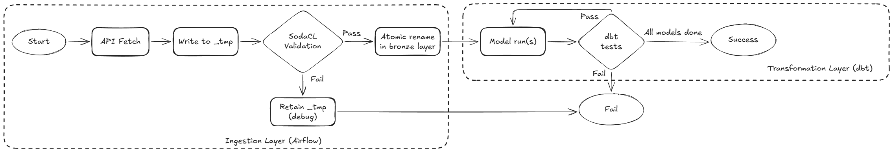
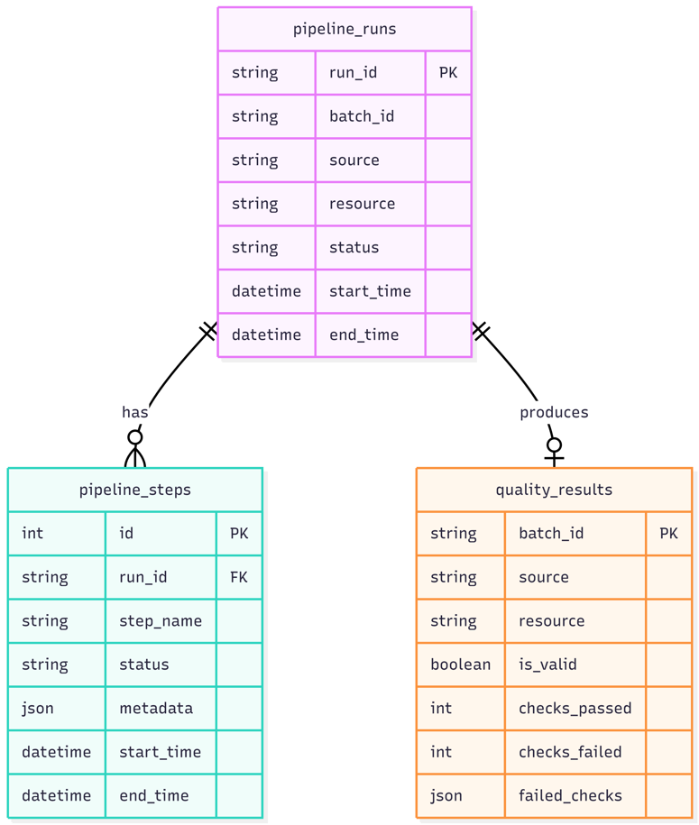
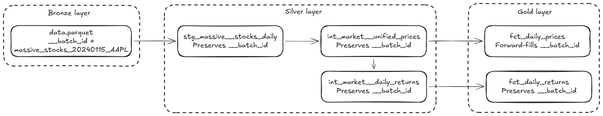
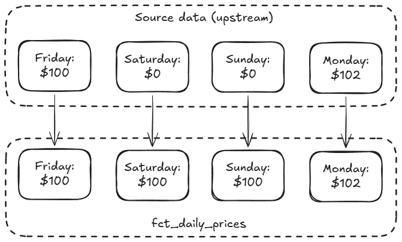

# Data Quality & Governance

## 1. Data Validation

The validation strategy operates at two layers, each catching different types of issues.



### Ingestion Layer 

A write-audit-publish pattern is implemented to ensure that only validated data enters the bronze layer. If data fails quality checks, it never reaches consumers.

| Phase | Action | Implementation |
| :--- | :--- | :--- |
| Write | Transform raw JSON to Parquet. | Output is written to a hidden `_tmp_{partition}` directory. |
| Audit | Run quality checks against the staged data. | Soda Core executes checks defined in `contracts/*.yaml`. |
| Publish | Atomically promote staged data to final location. | `os.rename()` swaps `_tmp` to the final partition path. This is an atomic OS operation. |

#### Soda Core

As a part of the write-audit-publish workflow, Soda Core is used to validate raw data immediately after extraction but *before* publication.

| Check Type | Example | Purpose |
|:---|:---|:---|
| Completeness | `missing_count(price_usd) = 0` | Ensure no null values in critical fields |
| Validity | `price_usd > 0` | Business logic constraints |
| Consistency | `high >= low` | Cross-column relationships |
| Uniqueness | Custom query for duplicate dates | No duplicate records per partition |

**Contract Location**: `airflow/plugins/common/contracts/resources/**/*.yaml`

### Transformation Layer (dbt Tests)

Once data is in the bronze layer, dbt tests ensure referential integrity and business logic constraints.

| Test Type | Example | Purpose |
|:---|:---|:---|
| `not_null` | `asset_id` | Critical columns must be present |
| `unique` | `dim_assets.asset_id` | Primary key integrity |
| `relationships` | `fct_daily_prices.asset_id to dim_assets` | Foreign key validity |
| `accepted_values` | `price_source IN ('OBSERVED', 'IMPUTED')` | Enum constraints |
| Custom | `assert_no_critical_gaps.sql` | No missing trading days for stocks/crypto |

**Schema Location**: `dbt/analysis/models/**/*.yml`

## 2. Quality Monitoring & Metrics

Every validation result is persisted to PostgreSQL for observability and historical analysis. A dashboard solution for monitoring the quality of the data pipeline is not implemented in this assessment due to overengineering concerns (since the assessment scope is fairly limited).

### Metadata Schema

The `pipeline_metadata` database contains three tables:



### Querying Quality Metrics

**Connect to the metadata database:**

```bash
docker exec -it bitcoin-analysis-postgres-1 psql -U airflow -d pipeline_metadata
```

**Quality Pass/Fail Rate by Source:**

```sql
SELECT 
    source,
    resource,
    COUNT(*) as total_runs,
    SUM(CASE WHEN is_valid THEN 1 ELSE 0 END) as passed,
    SUM(CASE WHEN NOT is_valid THEN 1 ELSE 0 END) as failed,
    ROUND(SUM(CASE WHEN is_valid THEN 1 ELSE 0 END) * 100.0 / COUNT(*), 1) as pass_rate_pct,
    MAX(created_at) as last_run
FROM quality_results
GROUP BY source, resource;
```

**Recent Validation Failures:**

```sql
SELECT batch_id, source, resource, failed_checks 
FROM quality_results 
WHERE is_valid = false 
ORDER BY created_at DESC 
LIMIT 5;
```

## 3. Data Lineage Tracking

Every record in the final reporting layer can be traced back to its original ingestion batch.

### Lineage Fields

| Field | Format | Example | Purpose |
|:---|:---|:---|:---|
| `__batch_id` | `{source}_{resource}_{date}_{ticker}` | `massive_stocks_20240115_AAPL` | Unique batch identifier |
| `__ingested_at` | ISO 8601 timestamp | `2024-01-15T08:30:00Z` | When data was extracted |

### Data Flow



### Debugging with Lineage

If a suspicious price appears in a report:

1. Query the fact table to find the `__batch_id`
2. Look up the batch in `pipeline_runs` and `pipeline_steps` for timing and metadata
3. Check the original staging file at `data/staging/source={source}/ingestion_date={date}/batch_id={batch_id}/`

### Visual Model Lineage

In addition to row-level lineage via metadata columns, a comprehensive visual lineage graph of the data models is also available. This dbt-generated documentation website illustrates the transformations from raw sources through staging and intermediate tables to the final marts.

*   File: [`dbt_docs.html`](../dbt_docs.html)
*   Features:
    *   Interactive Lineage Graph: Visualizes the Directed Acyclic Graph (DAG) of the project.
    *   Model Documentation: Detailed descriptions of every model, column, and applied test.
    *   Source Information: Metadata about the upstream data sources.

To view the documentation, simple open the HTML file in a web browser (it is a standalone static site).

## 4. Missing Data Strategy

Financial data has natural gaps (weekends, holidays, API failures). We handle this explicitly rather than ignoring it.

### Forward-Fill Imputation

We use a carry-forward strategy to ensure continuous price series for performance calculations, while tracking what is real vs. inferred.

