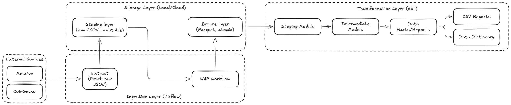

# Architecture & Design

## Problem Statement

This project implements a data pipeline to ingest, process, and analyze the comparative performance of Bitcoin against traditional assets (fiat currencies, stocks, and market indices). The core requirements from the assessment are:

*   Ingest daily historical data from market data aggregation platforms like CoinGecko and Massive
*   Support historical backfills (e.g., extending from 30 to 90 days) without duplicating records
*   Store processed data in a queryable format (e.g., CSV, database, Parquet)
*   Design a star schema with appropriate fact and dimension tables
*   Implement data quality checks (completeness, accuracy, consistency)

## Architectural Principles

The platform follows a minimalist lakehouse architecture with append-only ingestion semantics and batch-first transformations. This stance avoids the operational complexity of classic Lambda (two divergent stacks) and the state-management overhead of pure Kappa (stateful streaming). The core principles followed are:

1. All data, even if fetched via scheduled REST API calls, is treated as an immutable log. Raw responses are persisted immediately to the staging layer before any processing.
2. Business logic runs as scheduled batches (T-1) to process raw logs into queryable datasets. There is no requirement for sub-minute latency.
3. The storage layer is decoupled from the compute layer. This allows swapping engines without changing data.

This approach ensures perfect replayability and one canonical history, eliminating drift between ingestion and transformation logic.

## Requirements Mapping

The design was anchored on the specific requirements of the assessment:

| Requirement (from Assessment) | Constraint / Consideration | Architectural Decision |
| :--- | :--- | :--- |
| Ingest from CoinGecko/Massive APIs | APIs return T-1 daily data, no sub-minute freshness needed. | Daily Batch Ingestion (Airflow). Simpler and more robust than maintaining streaming consumers for APIs that only provide daily granularity. |
| Support historical backfills without duplication | Re-processing overlapping date ranges must be idempotent. | Idempotent Partitioning + Blue-Green Swap. Each `(date, ticker)` partition is an atomic unit. Re-ingesting a day overwrites cleanly via atomic rename. |
| Store in queryable format (CSV, Parquet, database) | Must be readable by analytical engines and potentially other systems. | Parquet in Hive-style layout. This is a common standard in most modern lakehouse architectures. Any engine (DuckDB, Spark, Trino, etc.) can read it directly. |
| Design star schema (facts + dimensions) | Schema must be formally defined and versioned. | dbt Models enforce schema in the transformation layer. `contracts/` YAML files act as a schema registry for the ingestion layer. |
| Implement data quality checks | Bad data must never reach downstream consumers or reports. | Write-Audit-Publish (WAP) Pattern with Soda Core (SodaCL). Validation happens on staged data *before* publication. Failures are caught at the gate. |

---

## 4. High-Level Data Flow

**Flow Summary:**
1.  **Extract**: Airflow DAGs fetch raw JSON from external APIs.
2.  **Stage**: Raw responses are written immediately to the staging layer (immutable log).
3.  **WAP Workflow**: The staging layer data goes through a write-audit-publish workflow, ensuring that ingested data is validated before being promoted to the (production) bronze layer.
    1.  **Transform**: Data is converted to Parquet and written to a temporary `_tmp` directory.
    2.  **Validate (Audit)**: Soda Core runs quality checks against the `_tmp` data.
    3.  **Publish**: If validation passes, the `_tmp` directory is atomically renamed to the final bronze layer partitions.
4.  **Model**: dbt reads from bronze layer, applies business logic, and writes to silver/gold layers.
5.  **Serve**: Downstream consumers (e.g., report/metadata generation) read from the gold layer.

## Implementation Patterns

### Write-Audit-Publish (WAP)

To guarantee data quality in a file-based lakehouse (where transactions are not ACID by default), we implement a WAP workflow at the filesystem layer:

| Phase | Action | Implementation |
| :--- | :--- | :--- |
| Write | Transform raw JSON to Parquet. | Output is written to a hidden `_tmp_{partition}` directory. |
| Audit | Run quality checks against the staged data. | Soda Core executes checks defined in `contracts/*.yaml`. |
| Publish | Atomically promote staged data to final location. | `os.rename()` swaps `_tmp` to the final partition path. This is an atomic OS operation. |

*   If the audit fails, the `_tmp` directory is discarded. Bad data should never reach the consumer under any circumstances.
*   This pattern simulates the ACID commit model of Iceberg/Delta Lake without requiring the catalog infrastructure.

### Blue-Green Deployment (for Data)

The WAP pattern provides blue-green deployment semantics:
*   Blue (Current): The existing verified data partition.
*   Green (New): The candidate data in `_tmp`.
*   Switch: The atomic OS rename swaps traffic instantly. Consumers never see partial writes.

### Daily Partitioning

Data is stored using Hive-style partitioning for efficient pruning:
*   Staging: `data/staging/source={source}/ingestion_date={date}/batch_id={uuid}/raw.json`
*   Bronze: `data/bronze/source={source}/resource={resource}/date={date}/data.parquet`

This layout enables:
*   Idempotent re-runs: Re-ingesting a specific date only touches that partition.
*   Efficient queries: DuckDB (or any other engine) can prune partitions at read time.

## Scalability Path

This assessment uses a Docker + local filesystem + DuckDB stack for portability reasons. However, the architecture is designed to scale to a production cloud environment with minimal code changes:

| Layer | Assessment Implementation | Production Evolution |
| :--- | :--- | :--- |
| Storage | Local Parquet files | S3/GCS. |
| Table Format | Manual Hive-style partitions | Apache Iceberg for schema evolution, time-travel, and atomic commits. The WAP pattern maps directly to Iceberg's commit model. |
| Compute (Transformation) | DuckDB (in-process) | Spark, Trino, etc. for distributed processing. |
| Compute (Orchestration) | Dockerized Airflow | Managed Airflow (MWAA, Cloud Composer), Dagster, Prefect, etc. |
| Catalog | `contracts/` YAML files | Formal catalog (Hive Metastore, Nessie for Iceberg branching). |
| Reverse ETL | N/A | Push curated data from Iceberg to operational systems (Postgres, APIs) using a reverse ETL mechanism. |

### Why Iceberg?

The current implementation uses manual partition swaps to simulate atomic commits. At scale, this would be replaced by **Apache Iceberg** because:
1.  ACID Transactions: Native support for atomic commits without manual renaming.
2.  Schema Evolution: Add/rename columns without rewriting data.
3.  Time Travel: Query historical snapshots for debugging or auditing.
4.  Hidden Partitioning: Decouples physical layout from logical queries.

The staging layer (raw JSON) would remain as a buffer to avoid the "small file problem" inherent in high-frequency Iceberg commits.

## Trade-offs

The following decisions were made for this assessment:

| We Chose | Instead of | Rationale |
| :--- | :--- | :--- |
| Local Filesystem | S3/GCS | Fast and easy portability. |
| Localized Airflow | Dagster, Prefect, etc. | While Dagster/Prefect iterates on Airflow's drawbacks, Airflow has a wider ecosystem & third-party library integration as the industry standard.  |
| DuckDB | Spark/Trino, OLAP/OLTP databases (Clickhouse, PostgreSQL) | Zero infrastructure overhead. DuckDB handles the assessment data volume in milliseconds. |
| Soda Core | Great Expectations, dbt tests, custom scripts | Soda's YAML DSL is simpler for defining basic checks. Great Expectations is more powerful but heavier to configure (and slow for complex configurations too). |
| Manual Partition Swaps | Iceberg/Delta Lake | Iceberg requires a catalog service (e.g., Hive Metastore). Our manual swap simulates the same ACID-like semantics for the assessment scope. |
| `contracts/` YAML | Formal Schema Registry (Confluent, Glue, etc.) | Lightweight and human-readable. A formal registry is needed at scale for governance and discoverability. |
| Daily Batch Ingestion | Streaming (Kafka + Flink) | The source APIs provide daily data. Streaming would add complexity without benefit. |
