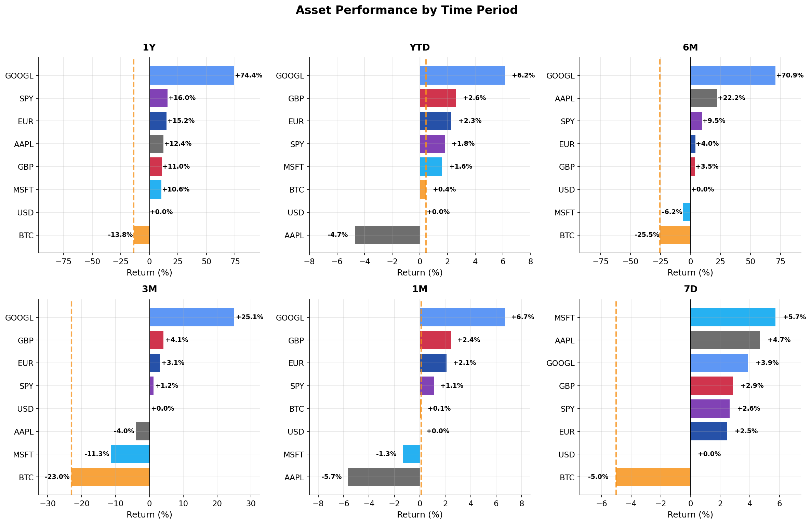
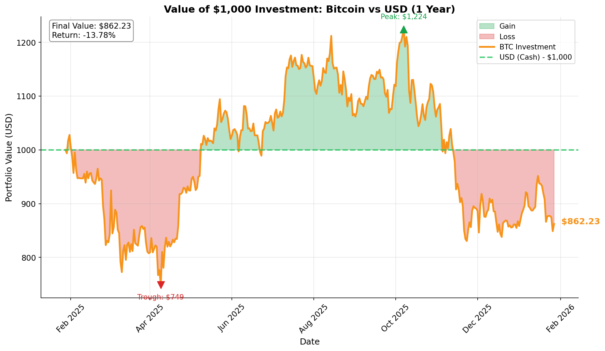
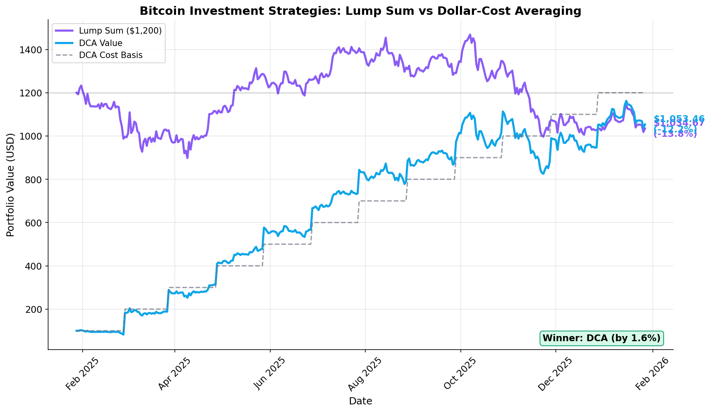
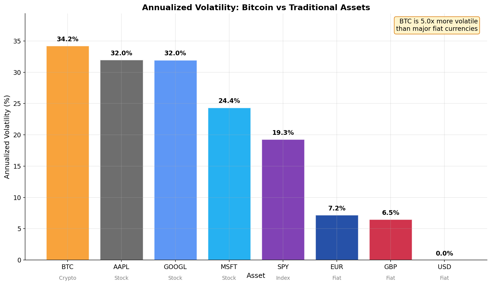

# Investment Analysis Report

This report analyzes the comparative performance of Bitcoin against traditional assets over the past year. The analysis covers stocks (AAPL, GOOGL, MSFT), market indices (SPY), and fiat currencies (EUR, GBP, USD) across multiple time horizons.

**Key Findings:**
- Bitcoin underperformed all traditional assets over the 1-year period, declining -13.8%
- Alphabet (GOOGL) was the top performer with +74.4% annual returns
- Dollar-cost averaging (DCA) outperformed lump-sum investing in Bitcoin by 1.6 percentage points
- Bitcoin remained approximately 5x more volatile than major fiat currencies

## 1. Asset Performance vs Bitcoin

**Question:** *Which asset outperformed Bitcoin across each time window (1Y, YTD, 6M, 3M, 1M, 7D)?*

Bitcoin consistently underperformed traditional assets across all measured time periods, with the exception of a few instances where it posted marginally positive returns.

| Period | Bitcoin Return | Top Performer | # Assets Outperforming BTC |
|:-------|---------------:|:--------------|:--------------------------:|
| 1Y | -13.8% | GOOGL (+74.4%) | 7 of 7 |
| YTD | +0.4% | GOOGL (+6.2%) | 5 of 7 |
| 6M | -25.3% | GOOGL (+70.9%) | 7 of 7 |
| 3M | -23.0% | GOOGL (+25.1%) | 7 of 7 |
| 1M | -1.3% | GOOGL (+6.7%) | 4 of 7 |
| 7D | -5.7% | MSFT (+5.7%) | 7 of 7 |

**1 Year (1Y):** All traditional assets outperformed BTC. While BTC declined by -13.8%, Alphabet (GOOGL) surged +74.4%, making it the standout performer. The S&P 500 (SPY) delivered solid returns of +16.0%, and even fiat currencies (EUR +15.2%, GBP +11.0%) outperformed the cryptocurrency.

**Year-to-Date (YTD):** Bitcoin posted a modest +0.4% gain, but was still outpaced by GOOGL (+6.2%), major fiat currencies (GBP +2.6%, EUR +2.3%), and SPY (+1.8%). Apple (AAPL) underperformed BTC during this window.

**6 Months (6M):** This period captured significant BTC weakness, with it falling -25.3% while GOOGL rallied +70.9% and AAPL gained +22.2%. Even Microsoft (MSFT), which had a relatively weak period, still outperformed BTC.

**3 Months (3M):** Bitcoin's decline of -23.0% was the worst among all assets. Only GOOGL (+25.1%) showed strong positive momentum, while other assets delivered modest single-digit returns or small losses.

**1 Month (1M):** A mixed picture emerged, with BTC down -1.3%. GOOGL (+6.7%) led gains, while AAPL (-5.7%) underperformed Bitcoin.

**7 Days (7D):** Bitcoin's -5.7% drop was the worst weekly performance. Meanwhile, MSFT (+5.7%) and AAPL (+4.7%) led the recovery.

---

## 2. Investment Simulation: $1000 One Year Ago

**Question:** *What is the current worth of a $1K USD vs Bitcoin investment made one year ago?*

| Investment | Initial Value | Final Value | Return | Gain/Loss |
|:-----------|:-------------:|:-----------:|:------:|:---------:|
| USD (Cash) | $1000.00 | $1000.00 | 0.00% | $0.00 |
| Bitcoin (BTC) | $1000.00 | $862.23 | -13.78% | -$137.77 |

A $1000 investment in BTC made one year ago (January 28, 2025) would be worth $862.23 today, a loss of $137.77 or -13.78%. In contrast, holding USD as cash preserved the full nominal value.

Key observations from the investment trajectory:
- Peak Value: $1224 (reached in October 2025), a +22.4% gain at the high
- Trough Value: $749 (reached in April 2025), a -25.1% loss at the low
- Recovery: Bitcoin partially recovered from its April lows but failed to return to breakeven by year-end

The chart illustrates the significant volatility experienced during the holding period, with the investment spending the majority of the year underwater (below the $1000 baseline).

---

## 3. Dollar-Cost Averaging vs Lump Sum Strategy

**Question:** *How do returns compare for $100/month dollar-cost averaging into Bitcoin over 12 months vs an initial lump sum?*

| Strategy | Total Invested | Final Value | Return |
|:---------|:--------------:|:-----------:|:------:|
| **Lump Sum** | $1200 | $1034.67 | -13.78% |
| **DCA ($100/month)** | $1200 | $1053.46 | -12.21% |

In this 1-year period, Dollar-Cost Averaging outperformed the Lump Sum strategy by 1.6 percentage points, limiting losses to -12.21% compared to -13.78% for the lump sum approach.

**Why DCA Won in This Period:**

1. Bitcoin's price declined over the year, meaning the lump sum investor bought at the year's relative high
2. DCA investors purchased Bitcoin at various price points throughout the year, including during the April 2025 dip, which lowered their average cost basis
3. The monthly purchase schedule reduced the impact of any single price point

However, there are some important points to highlight:

- This result is period-specific. In bull markets, lump sum investing typically outperforms DCA because earlier purchases capture more upside
- DCA works well when the market is down because it spreads the purchases out over time. This protects a trader from the risk of going all in at the worst possible moment

---

## 4. Volatility Comparison: Bitcoin vs Fiat Currencies

**Question:** *Based on these numbers, which was more volatile: fiat currencies or Bitcoin?*

### Annualized Volatility Results

| Asset | Category | Annualized Volatility |
|:------|:---------|----------------------:|
| Bitcoin (BTC) | Crypto | 34.2% |
| Apple (AAPL) | Stock | 32.0% |
| Alphabet (GOOGL) | Stock | 32.0% |
| Microsoft (MSFT) | Stock | 24.4% |
| S&P 500 (SPY) | Index | 19.3% |
| Euro (EUR) | Fiat | 7.2% |
| British Pound (GBP) | Fiat | 6.5% |
| US Dollar (USD) | Fiat | 0.0% |

Bitcoin was significantly more volatile than fiat currencies, exhibiting annualized volatility of 34.2% compared to 7.2% for EUR and 6.5% for GBP.

- **Bitcoin vs Fiat:** BTC is approximately 5x more volatile than major fiat currencies
- **Bitcoin vs Stocks:** BTC volatility is comparable to individual tech stocks (AAPL, GOOGL) but higher than diversified indices (SPY)
- **Bitcoin vs S&P 500:** BTC is 1.8x more volatile than the market index

The potential implication for anyone investing in Bitcoin would be the following:

1. Bitcoin's volatility profile places it firmly in the high-risk asset category
2. Because the price swings are unpredictable, it's smarter to keep the invested amount relatively small
3. Even though Bitcoin is risky on its own, it doesn't move in sync with the stock market. This means adding a little bit can actually help balance out an overall portfolio

---

## Notes

- **Data Sources:** CoinGecko (Bitcoin), Massive API (Stocks, Forex)
- **Price Type:** Daily closing prices
- **Volatility Calculation:** Standard deviation of daily returns, annualized using 252 (trading days)
- **DCA Timing:** Monthly purchases on the 28th of each month (or next available trading day)
- **Return Calculation:** (End Price / Start Price) - 1
