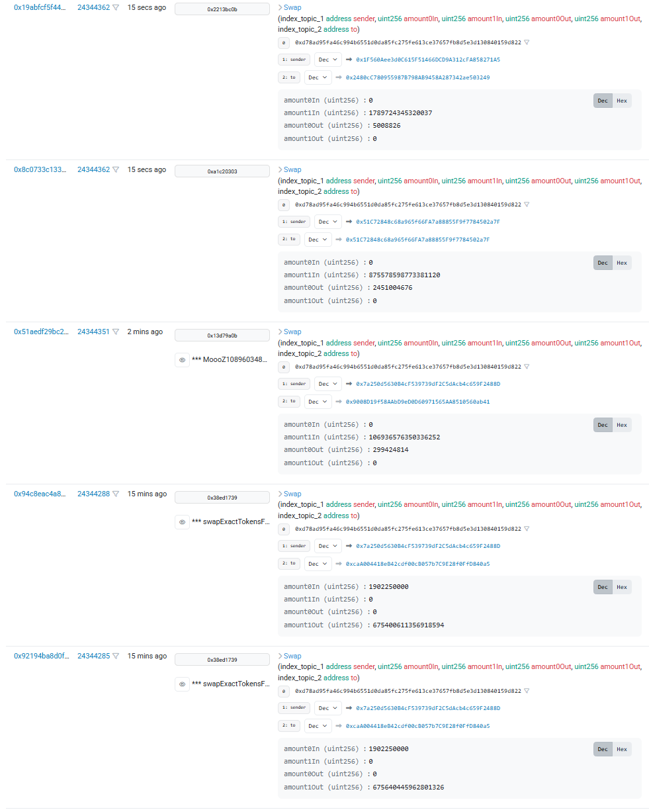
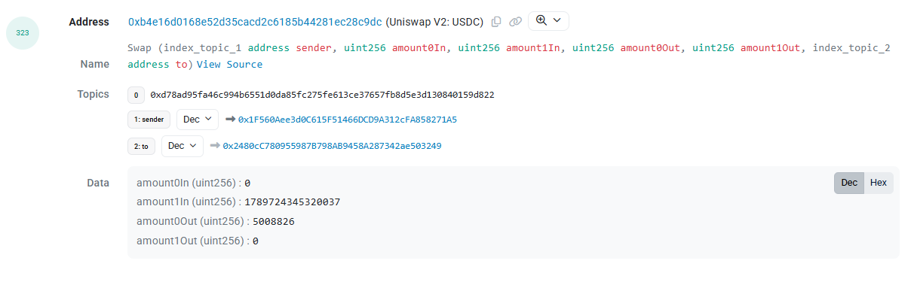

# Extra Credit: Uniswap V2 USDC/WETH Pool Analysis

This analysis focuses on the Uniswap V2 USDC/WETH contract (Address: `0xb4e16d0168e52d35cacd2c6185b44281ec28c9dc`).

## 1. Recent Swap Activity
The screenshot below captures the most recent swap events from the contract's Events tab on Etherscan.

---

## 2. Transaction Analysis
A specific transaction was selected for detailed analysis to decode the raw event data into human-readable values.

**Transaction Hash**: [`0x19abfcf5f445c233ac63eaeb2f929ea9784c7e5192002ca3bda34f3b56767cd6`](https://etherscan.io/tx/0x19abfcf5f445c233ac63eaeb2f929ea9784c7e5192002ca3bda34f3b56767cd6)

### 2.1 Event Log Data
From the transaction logs, I extracted the following raw values for the swap event.

| Parameter | Raw Value | Description |
| :--- | :--- | :--- |
| **sender** | `0x1F560Aee3d0C615F51466DCD9A312cFA858271A5` | The address initiating the swap interaction. |
| **amount0In** | `0` | The amount of USDC (Token0) sold (input) to the pool. |
| **amount1In** | `1789724345320037` | The amount of WETH (Token1) sold (input) to the pool. |
| **amount0Out** | `5008826` | The amount of USDC (Token0) bought (output) from the pool. |
| **amount1Out** | `0` | The amount of WETH (Token1) bought (output) from the pool. |
| **to** | `0x2480cC780955987B798AB9458A287342ae503249` | The recipient address receiving the USDC. |

### 2.2 Token/Value Identification
To interpret the amounts, the tokens corresponding to `token0` and `token1` in this specific pair must be identified.

*   Token0: [USDC (USD Coin)](https://etherscan.io/token/0xA0b86991c6218b36c1d19D4a2e9Eb0cE3606eB48)
    *   Address: `0xA0b86991c6218b36c1d19D4a2e9Eb0cE3606eB48`
*   Token1: [WETH (Wrapped Ether)](https://etherscan.io/token/0xC02aaA39b223FE8D0A0e5C4F27eAD9083C756Cc2)
    *   Address: `0xC02aaA39b223FE8D0A0e5C4F27eAD9083C756Cc2`

**Calculation Formula**:
$$ \text{Readable Amount} = \frac{\text{Raw Amount}}{10^{\text{Decimals}}} $$

**1. WETH Amount (amount1In)**:
$$\frac{1789724345320037}{10^{18}} \approx \mathbf{0.0017897 \text{ WETH}}$$

**2. USDC Amount (amount0Out)**:
$$\frac{5008826}{10^6} = \mathbf{5.008826 \text{ USDC}}$$

### 3. Conclusion
The sender swapped **0.0017897 WETH** for approximately **5.008826 USDC**.